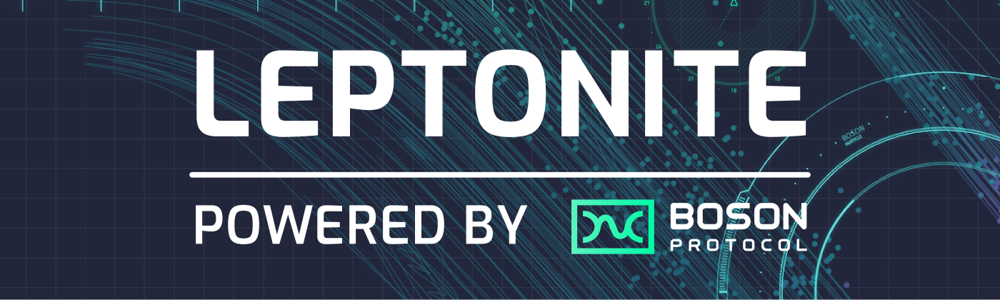
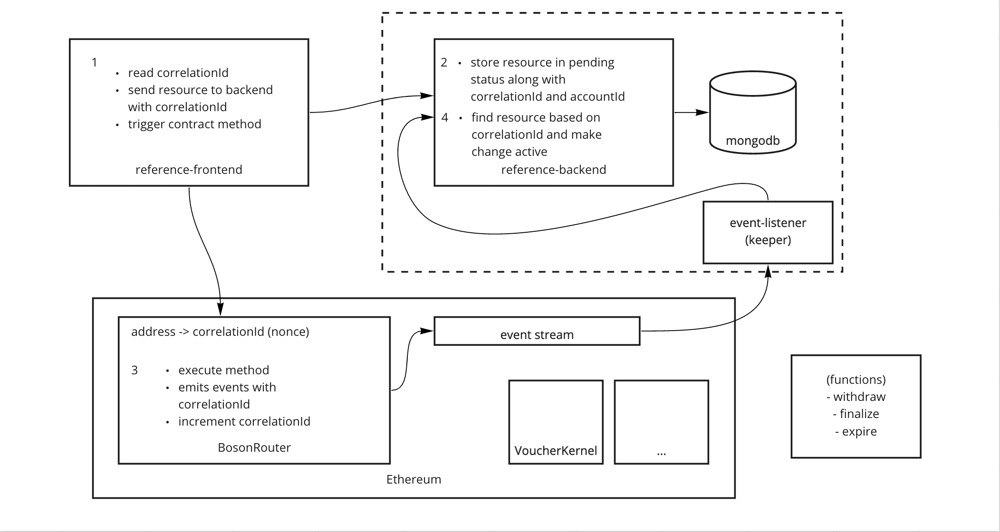

[](https://bosonprotocol.io)

<h1 align="center">Boson Protocol Reference Backend</h1>


[](https://gitter.im/bosonprotocol/community)

This is a reference application which demonstrates how to integrate Boson Protocol into a NodeJS back-end. This repository contains a MongoDB service as well as keeper functions & event listeners.

This reference application shows you how to build a p2p marketplace powered by Boson Protocol. Users can connect their wallets and list a set of items as a seller, as well as discover products that can be purchased as a buyer. The application also demonstrates how to the transaction lifecycle can be tracked and co-ordinated by both parties.

Live demo running on the Rinkeby test network:
https://reference-app.bosonprotocol.io

---
**Table of Contents**

- [Design & Architecture](#design--architecture)
- [Local Development](#local-development)
  - [Prerequisites](#prerequisites)
  - [Configuration](#configuration)
  - [Build](#build)
  - [Run](#run)
  - [Test](#test)
  - [Code Linting & Formatting](#code-linting--formatting)
- [Contributing](#contributing)
- [License](#license)

---
## Design & Architecture

The application architecture is as depicted below. There are various components to this:
- `Frontend` (details can be found in the [`reference-frontend`](https://github.com/bosonprotocol/reference-frontend) repository)
- `Backend`
    - `Server`
    - `Database`
    - `Keepers service` - These are cloud functions which run periodically to trigger certain contract methods such as expiry/finalization.
    - `Event Listeners` - This listens for blockchain events and updates the backend accordingly.
- `Smart contracts` (details can be found in the [`contracts`](https://github.com/bosonprotocol/contracts) repository)

[](#design-&-architecture)

---
## Local Development

### Prerequisites

For local development of the reference-backend, your development machine will need a few
tools installed.

At a minimum, you'll need:
* Node (12.20)
* NPM (> 6)
* Ruby (2.7)
* Bundler (> 2)
* Git
* Docker
* direnv

For instructions on how to get set up with these specific versions:
* See the [OS X guide](docs/setup/osx.md) if you are on a Mac.
* See the [Linux guide](docs/setup/linux.md) if you use a Linux distribution.

---
### Configuration
Prior to running the application, you must set up a `.env` file in the project's root directory with the following environment variables:
- `TOKEN_SECRET` - What is this?
- `GCLOUD_SECRET` - Is this still needed if we're using AWS?
- `VOUCHERS_BUCKET` - This is the name for the bucket to push images to.

---
### Build
We have a fully automated local build process to check that your changes are
good to be merged. To run the build:

```shell script
./go
````

By default, the build process fetches all dependencies, compiles, lints,
formats and tests the codebase. There are also tasks for each step. This and
subsequent sections provide more details of each of the tasks.

To fetch dependencies:

```shell script
./go app:dependencies:install
```

---
### Run
A task has been created which will:
 - Install any necessary dependencies
 - Provision a local database
 - Run the server locally
 - Run a local keepers service (dependent on local contracts deployment as described in the [`contracts`](https://github.com/bosonprotocol/contracts) repository).
 - Run local event listeners (dependent on local contracts deployment as described in the [`contracts`](https://github.com/bosonprotocol/contracts) repository).

This can be executed by running the following from the project root directory:
```shell
./go app:run
```

---
### Test
All tests are written using
[Chai's JavaScript testing](https://www.chaijs.com/guide/)
support.

#### Unit Tests
To run the unit tests:

```shell script
./go tests:app:unit
```

#### Component Tests
To run the component tests:

```shell script
./go tests:app:component
```

#### Persistence Tests
To run the persistence tests:

```shell script
./go tests:app:persistence
```

---
### Code Linting & Formatting

Both the app itself and the tests are linted and formatted as part of
the build process.

For the tests, we use:
* [eslint](https://eslint.org/) for linting
* [prettier](https://prettier.io/) for formatting

To lint the app:

```shell script
./go app:lint
```

This will check if the linter is satisfied. If instead you want to attempt to
automatically fix any linting issues:

```shell script
./go app:lint_fix
```

To check the formatting of the app:

```shell script
./go app:format
```

To automatically fix formatting issues:

```shell script
./go app:format_fix
```

Similarly, for the tests, to perform the same tasks:

```shell script
./go tests:app:lint
./go tests:app:lint_fix
./go tests:app:format
./go tests:app:format_fix
```

---
## Contributing

We welcome contributions! Until now, Boson Protocol has been largely worked on by a small dedicated team. However, the ultimate goal is for all of the Boson Protocol repositories to be fully owned by the community and contributors. Issues, pull requests, suggestions, and any sort of involvement are more than welcome.

If you have noticed a bug, [file an issue](/issues). If you have a large pull request, we recommend filing an issue first; small PRs are always welcome.

Questions are also welcome, as long as they are tech related. We can use them to improve our documentation.

All PRs must pass all tests before being merged.

By being in this community, you agree to the [Code of Conduct](CODE_OF_CONDUCT.md). Take a look at it, if you haven't already.

---
## License

Licensed under [LGPL v3](LICENSE).
