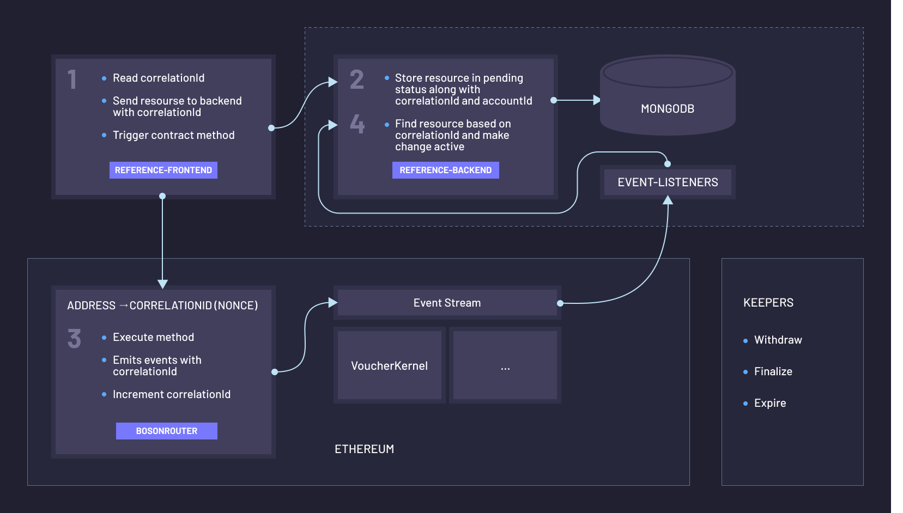

[](https://leptonite.io)

<h1 align="center">Leptonite - Powered by Boson Protocol</h1>

[](https://gitter.im/bosonprotocol/community)

This is a reference application which demonstrates how to integrate Boson Protocol into a NodeJS back-end. This repository contains a MongoDB service as well as keeper functions & event listeners.

This reference app may be used as a template for building your own marketplace powered by Boson Protocol. Users can connect their wallets and list a set of items as a seller, as well as discover products that can be purchased as a buyer. The application also demonstrates how to the transaction lifecycle can be tracked and co-ordinated by both parties.

---
**Table of Contents**

- [Design & Architecture](#design--architecture)
- [Local Development](#local-development)
  - [Prerequisites](#prerequisites)
  - [Configuration](#configuration)
  - [Build](#build)
  - [Run (Linux / Mac OS X)](#run-linux--mac-os-x)
  - [Run (Windows)](#run-windows)
  - [Test](#test)
    - [Unit Tests](#unit-tests)
    - [Component Tests](#component-tests)
    - [Persistence Tests](#persistence-tests)
  - [Code Linting & Formatting](#code-linting--formatting)
- [Contributing](#contributing)
- [License](#license)

---
## Design & Architecture

The application architecture is as depicted below. There are various components to this:
- `Frontend` (details can be found in the [`reference-frontend`](https://github.com/bosonprotocol/reference-frontend) repository)
- `Backend`
    - `Server`
    - `Database`
    - `Keepers service` - These are cloud functions which run periodically to trigger certain contract methods such as expiry/finalization. Details can be found [here](https://github.com/bosonprotocol/reference-backend/tree/develop/external/keepers).
    - `Event Listeners` - This listens for blockchain events and updates the backend accordingly. Details can be found [here](https://github.com/bosonprotocol/reference-backend/tree/develop/external/lambdas).
- `Smart contracts` (details can be found in the [`contracts`](https://github.com/bosonprotocol/contracts) repository)

[](#design-&-architecture)

---
## Local Development

### Prerequisites

For local development of the reference-backend, your development machine will need a few
tools installed. These will allow you to run the ruby scripts (executed as `./go [args]`) to build and test the project.

At a minimum, you'll need:
* Node (12.20)
* NPM (> 6)
* Ruby (2.7)
* Bundler (> 2)
* Git
* Docker
* direnv
  * This easily allows environment variables to be switched when navigating between project directories (e.g. `contracts`, `reference-backend` and `reference-frontend`). You will be prompted to run `direnv allow` to enable this.
  
For instructions on how to get set up with these specific versions:
* See the [OS X guide](docs/setup/osx.md) if you are on a Mac.
* See the [Linux guide](docs/setup/linux.md) if you use a Linux distribution.

---
### Configuration
Prior to running the application, you must set up a `.env` file in the project's root directory with the following environment variables:
- `TOKEN_SECRET` - The token used to authenticate the user. Based on the verification with the secret, we derive the user's address.
- `GCLOUD_SECRET` - The token used to authenticate requests from the Event Listeners and Keepers.

---
### Build
We have a fully automated local build process to check that your changes are
good to be merged. To run the build:

```shell script
./go
````

By default, the build process fetches all dependencies, compiles, lints,
formats and tests the codebase. There are also tasks for each step. This and
subsequent sections provide more details of each of the tasks.

To fetch dependencies:

```shell script
./go app:dependencies:install
```

---
### Run (Linux / Mac OS X)
A task has been created which will:
 - Install any necessary dependencies
 - Provision a local database
 - Run the server locally
 - Run a local keepers service (dependent on local contracts deployment as described in the [`contracts`](https://github.com/bosonprotocol/contracts) repository - see "Run" section).
 - Run local event listeners (dependent on local contracts deployment as described in the [`contracts`](https://github.com/bosonprotocol/contracts) repository - see "Run" section).

This can be executed by running the following from the project root directory:
```shell
./go app:run
```

---
### Run (Windows)
On Windows, the 'go' script is not supported.
You will need to:
 - Run a MongoDB database instance (can be local or cloud hosted, like MongoDb Atlas). Be sure the deployed instance is secured with authentication enforced (https://docs.mongodb.com/guides/server/auth/)
 
 * Create a file './.env' on the basis of './.env.example' with the following information:
    ```
    DB_CONNECTION_STRING=mongodb://localhost:27017
    DB_NAME=api
    DB_USERNAME=admin
    DB_PASSWORD=secret

    TOKEN_SECRET=1fdd5ab2823e118ee997219330c7abc37a56a5093b753b545ab40e5f216491eec5d400f121e678d6c5b03b01f2e56e1fd14b79afd5c0fdd61477ce469472a8a6
    GCLOUD_SECRET=1f123ce56aeec5d400b2823e7abc121e6756e1f4b118ee

    VOUCHERS_BUCKET="vouchers-upload-images-bucket"
    ```
    Where:
    * DB_CONNECTION_STRING: the connection string to the DB
    * DB_NAME: the name of the DB (will be created)
    * DB_USERNAME/DB_PASSWORD: login/password to access the database
    * TOKEN_SECRET: see §Configuration above
    * GCLOUD_SECRET: see §Configuration above
 * Run the API server:
    ```shell
    npm install
    set PORT=3333
    npm run start
    ```
 * Create a file './external/keepers/src/.env' on the basis of './external/keepers/src/.env.example' with the following information:
    ```
    TOKENS_CONTRACT_ADDRESS="0x..."
    BOSON_ROUTER_CONTRACT_ADDRESS="0x..."
    VOUCHER_KERNEL_ADDRESS="0x..."
    API_URL="http://localhost:3333"
    GCLOUD_SECRET="GENERATED_TOKEN"
    ALCHEMY_URL="https://eth-desired-network.alchemyapi.io/v2/your-api-key"
    ```
    Where:
    * TOKENS_CONTRACT_ADDRESS: the address of the ERC1155721 contract
    * BOSON_ROUTER_CONTRACT_ADDRESS: the address of the BosonRouter contract
    * VOUCHER_KERNEL_ADDRESS: the address of the VoucherKernel contract
    * API_URL: the URL of the backend API server (started above)
    * GCLOUD_SECRET: generated on http://jwtbuilder.jamiekurtz.com with payload = {token: <GCLOUD_SECRET>} and key=<TOKEN_SECRET>, where GCLOUD_SECRET and TOKEN_SECRET values are defined in the env var of the API server
    * ALCHEMY_URL: URL of the blockchain entry node (Alchemy, Infura, ...). If omitted will fallback to local rpc at port 8545 (default)
 * Run the Keepers service:
    ```shell
    npm run start:local:keepers
    ```
 * Create a file './external/lambdas/.env' on the basis of './external/lambdas/.env.example' with the following information:
    ```
    TOKENS_CONTRACT_ADDRESS="0x..."
    BOSON_ROUTER_CONTRACT_ADDRESS="0x..."
    CASHIER_ADDRESS="0x..."
    VOUCHER_KERNEL_ADDRESS="0x..."
    EXECUTOR_PRIVATE_KEY="0x..."
    API_URL="http://localhost:3333"
    GCLOUD_SECRET="GENERATED_TOKEN"
    PROVIDER_URL="https://eth-desired-network.alchemyapi.io/v2/your-api-key"
    #If the provider requires a secret authorization field in the request header (like Infura)
    PROVIDER_SECRET=
    ```
    Where:
    * TOKENS_CONTRACT_ADDRESS: the address of the ERC1155721 contract
    * BOSON_ROUTER_CONTRACT_ADDRESS: the address of the BosonRouter contract
    * CASHIER_ADDRESS: the address of the Cashier contract
    * VOUCHER_KERNEL_ADDRESS: the address of the VoucherKernel contract
    * EXECUTOR_PRIVATE_KEY: the private key of the wallet to be used to interact with the contracts
    * API_URL: the URL of the backend API server (started above)
    * GCLOUD_SECRET: generated on http://jwtbuilder.jamiekurtz.com with payload = {token: <GCLOUD_SECRET>} and key=<TOKEN_SECRET>, where GCLOUD_SECRET and TOKEN_SECRET values are defined in the env var of the API server
    * PROVIDER_URL: URL of the blockchain entry node (Alchemy, Infura, ...). If omitted will fallback to local rpc at port 8545 (default)
    * PROVIDER_SECRET: (optional) if the provider requires a secret authorization field in the request header (like Infura)
 * Run the Triggers service:
    ```shell
    npm run start:local:triggers
    ```

---
### Test
All tests are written using
[Chai's JavaScript testing](https://www.chaijs.com/guide/)
support.

#### Unit Tests
To run the unit tests:

```shell script
./go tests:app:unit
```

#### Component Tests
To run the component tests:

```shell script
./go tests:app:component
```

#### Persistence Tests
To run the persistence tests:

```shell script
./go tests:app:persistence
```

---
### Code Linting & Formatting

Both the app itself and the tests are linted and formatted as part of
the build process.

For the tests, we use:
* [eslint](https://eslint.org/) for linting
* [prettier](https://prettier.io/) for formatting

To lint the app:

```shell script
./go app:lint
```

This will check if the linter is satisfied. If instead you want to attempt to
automatically fix any linting issues:

```shell script
./go app:lint_fix
```

To check the formatting of the app:

```shell script
./go app:format
```

To automatically fix formatting issues:

```shell script
./go app:format_fix
```

Similarly, for the tests, to perform the same tasks:

```shell script
./go tests:app:lint
./go tests:app:lint_fix
./go tests:app:format
./go tests:app:format_fix
```

---
## Contributing

We welcome contributions! Until now, Boson Protocol has been largely worked on by a small dedicated team. However, the ultimate goal is for all of the Boson Protocol repositories to be fully owned by the community and contributors. Issues, pull requests, suggestions, and any sort of involvement are more than welcome.

If you have noticed a bug, [file an issue](/issues). If you have a large pull request, we recommend filing an issue first; small PRs are always welcome.

Questions are also welcome, as long as they are tech related. We can use them to improve our documentation.

All PRs must pass all tests before being merged.

By being in this community, you agree to the [Code of Conduct](CODE_OF_CONDUCT.md). Take a look at it, if you haven't already.

---
## License

Licensed under [LGPL v3](LICENSE).
